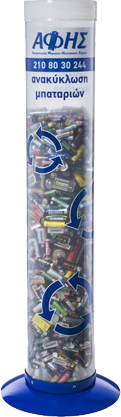

[&#8592; Επιστροφή](readme.md)

# Μπαταρίες

## Γιατί τις ανακυκλώνουμε
Οι μπαταρίες είναι φορητές συσκευές στις οποίες αποθηκεύεται χημική ενέργεια, η οποία αποδεσμεύεται ως ηλεκτρική κατά την χρήση τους. 
Για να το πετύχουν αυτό, περιέχουν βαρέα μέταλλα και τοξικά χημικά, τα οποία, όταν αυτές πετιούνται στα σκουπίδια, διαρρέουν στο περιβάλλον, μολύνοντας το έδαφος και τα ύδατα. 
Με την ανακύκλωσή τους αποτρέπεται η ρύπανση του περιβάλλοντος, καθώς οι μπαταρίες επεξεργάζονται μηχανικά για την αποσύνθεσή τους σε ειδικά διαμορφωμένα εργοστάσια.

## Οδηγίες συλλογής
Όταν ο κάδος μπαταριών γεμίσει, μπορεί να γίνει αίτηση παραλαβής ή αντικατάστασης στη <a href="https://afis.gr/aitiseis-gia-yparchonta-simeia-syllogis/" target="_blank">σελίδα της ΑΦΗΣ</a>.

Η είσοδος γίνεται είτε με ΑΦΜ είτε με κινητό τηλέφωνο.

