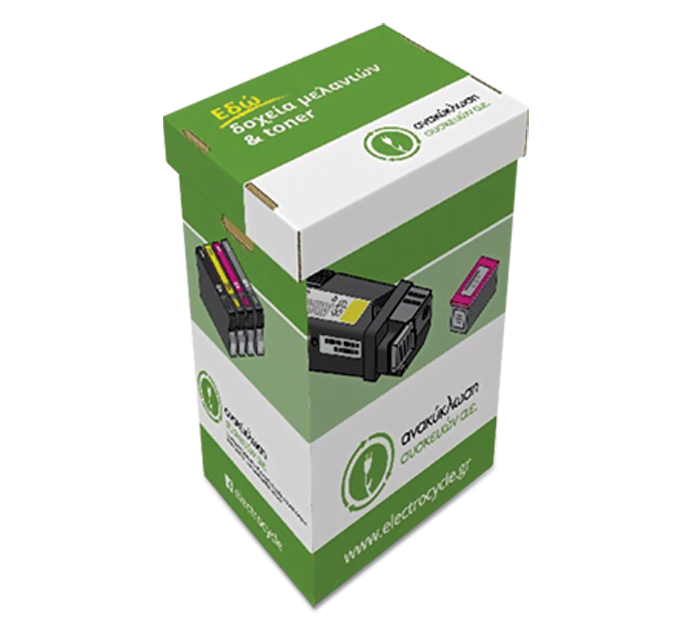

# Μελανοδοχεία/Toners

## Γιατί τα ανακυκλώνουμε

Τα μελανοδοχεία είναι φτιαγμένα από πλαστικό, το οποίο καταλήγει σε χώρους υγειονομικής ταφής όταν πετιούνται στα απλά σκουπίδια.
Τα toners περιέχουν και σκόνη γραφίτη, η οποία επίσης συμβάλει στη μόλυνση του περιβάλλοντος.
Με την ανακύκλωσή τους αποτρέπουμε όχι μόνο τη ρύπανση του εδάφους, αλλά και τη δημιουργία νέων δοχείων από το μηδέν, 
καθώς τα άδεια δοχεία ξαναγεμίζουν και επανέρχονται στην αγορά.

## Οδηγίες συλλογής

Το Τμήμα Ψηφιακών Συστημάτων συνεργάζεται με την εταιρία <a href="https://www.electrocycle.gr/" target="_blank">Ανακύκλωση Συσκευών Α.Ε.</a>,   
η οποία παραχωρεί κάδους ανακλύκλωσης και παρέχει υπηρεσίες συλλογής.

Όταν ένας κάδος γεμίσει, πρέπει να γίνει αίτηση συλλογής ηλεκτρονικά στην εφαρμογή 
<a href="https://electrocycle.itn.services/Trash/login.aspx" target="_blank">e-weee collection</a>, 
επιλέγοντας "Είσοδος" και εισάγοντας τους κωδικούς πρόσβασης.

* Καταχώρηση εντολής παραλαβής ΑΗΗΕ 
  - Εντολές &#8594; Εντολή παραλαβής ΑΗΗΕ
* Εντολή αρχικής τοποθέτησης κάδου συλλογής ΑΗΗΕ
  - Κάδοι &#8594; Αίτηση για κάδο &#8594; Επιλέξετε κάδο και πατήστε το μολυβάκι στα αριστερά
