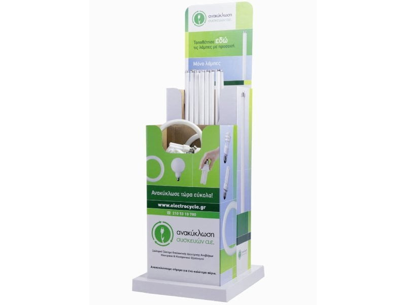

[&#8592; Επιστροφή](readme.md)

# Λάμπες

## Γιατί τις ανακυκλώνουμε

Οι λαμπτήρες φθορισμού περιέχουν υδράργυρο. 
Κατά την διαδικασία ανακύκλωσης σπάνε σε μικρά κομμάτια και ο υδράργυρος διαχωρίζεται και αποθηκεύεται με ασφάλεια. 
Τα υλικά που απομένουν μετά το τέλος αυτής της διαδικασίας (υδράργυρος, γυαλί, μέταλλο) ξαναχρησιμοποιούνται σε άλλες εφαρμογές.

## Οδηγίες συλλογής

Το Τμήμα Ψηφιακών Συστημάτων συνεργάζεται με την εταιρία <a href="https://www.electrocycle.gr/" target="_blank">Ανακύκλωση Συσκευών Α.Ε.</a>,   
η οποία παραχωρεί κάδους ανακλύκλωσης και παρέχει υπηρεσίες συλλογής.

Όταν ένας κάδος γεμίσει, πρέπει να γίνει αίτηση συλλογής ηλεκτρονικά στην εφαρμογή 
<a href="https://electrocycle.itn.services/Trash/login.aspx" target="_blank">e-weee collection</a>, 
επιλέγοντας "Είσοδος" και εισάγοντας τους κωδικούς πρόσβασης.

* Καταχώρηση εντολής παραλαβής ΑΗΗΕ 
  - Εντολές &#8594; Εντολή παραλαβής ΑΗΗΕ
* Εντολή αρχικής τοποθέτησης κάδου συλλογής ΑΗΗΕ
  - Κάδοι &#8594; Αίτηση για κάδο &#8594; Επιλέξετε κάδο και πατήστε το μολυβάκι στα αριστερά
