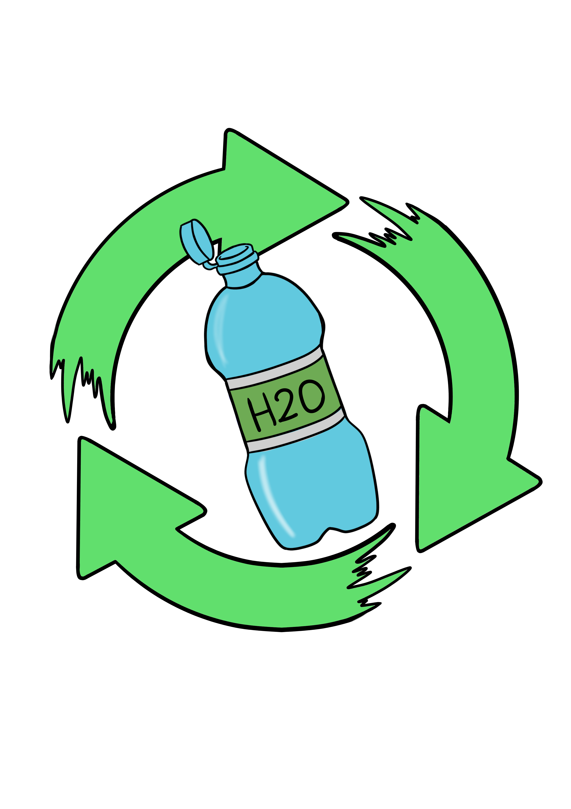

[&#8592; Επιστροφή](readme.md)

# Πλαστικό

## Γιατί το ανακυκλώνουμε

Όταν πετιούνται στα σκουπίδια, τα πλαστικά καταλήγουν να θάβονται ή να καίγονται, δύο διαδικασίες οι οποίες επιβαρύνουν το περιβάλλον και προκαλούν εκπομπές διοξειδίου του άνθρακα. 
Με την ανακύκλωσή τους, τα απόβλητα αυτά μειώνονται.

Για να ανακυκλωθούν συγκεντρώνονται και συνήθως τεμαχίζονται για να λιώσουν προτού μπουν σε καλούπια και πάρουν νέα μορφή. 
Πέρα από αυτή τη μέθοδο που είναι και η δημοφιλέστερη, υπάρχουν και άλλοι τρόποι ανακύκλωσής τους, όπως η χημική ή η αναβάθμιση. 
Δυστυχώς, πολλά είδη πλαστικών, ειδικότερα τα μαλακά πλαστικά, δεν είναι ανακυκλώσιμα.

<table>
  <tbody>
    <tr>
      <th align="center">Ανακυκλώσιμο πλαστικό</th>
      <th align="center">Μη ανακυκλώσιμο πλαστικό</th>
    </tr>
    <tr>
      <td>
        <ul>
          <li>Πλαστικά μπουκάλια</li>
          <li>Πλαστικές συσκευασίες τροφίμων</li>
          <li>Πλαστικά μπολ (σαλάτας, γιαουρτιού, κλπ)</li>
          <li>Πλαστικές σακούλες</li>
        </ul>
      </td>
      <td>
        <ul>
          <li>Αυτοδιασπόμενες σακούλες</li>
          <li>Πλαστικά μαχαιροπίρουνα</li>
          <li>Καλαμάκια</li>
          <li>Μεμβράνη</li>
          <li>Μικρά πλαστικά αντικείμενα μιας χρήσης</li>
        </ul>
      </td>
    </tr>
  </tbody>
</table>

## Οδηγίες Συλλογής

Ο <a href="https://www.larissa.gov.gr/el/e-upiresies/dnsi-kathariotitas-anakyklosis" target="_blank">Δήμος Λαρισαίων</a> είναι ο υπεύθυνος φορέας συλλογής πλαστικών, μετταλικών και χάρτινων συσκευασιών.

Για το πλαστικό παραχωρήθηκε πορτοκαλί κάδος 120 λίτρων ο οποίος, όπως και οι άλλοι δύο, πρέπει να αδειάζεται στον μεγαλύτερο κάδο (μπλε με πορτοκαλί καπάκι) που η υπηρεσία
Καθαριότητας έχει τοποθετήσει στον εξωτερικό χώρο του πανεπιστημίου.

Πρέπει να χρησιμοποιείται σακούλα που δεν πετιέται, αλλά αδειάζεται **χύμα**
το περιεχόμενό της στους μεγαλύτερους κάδους.

Τους μεγάλους κάδους αδειάζει η υπηρεσία Καθαριότητας, τμήμα
αποκομιδής (τηλ. 2410-575050)
