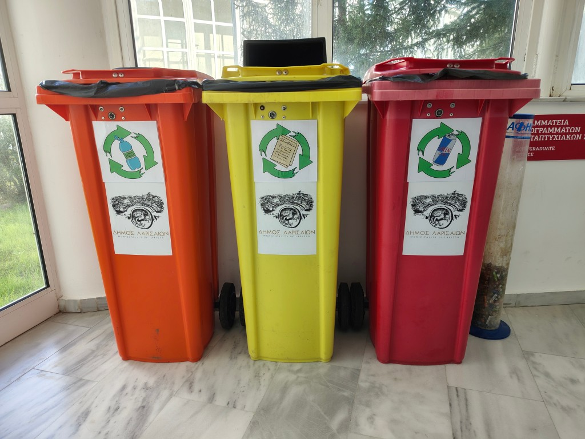

Το Τμήμα Ψηφιακών Συστημάτων εφαρμόζει διαδικασίες *διαλογής στην πηγή* για τα παρακάτω απορρίμματα:

| Απορρίμματα | Σημείο συλλογής | Φορέας συλλογής |
| ----------- | :-------: | :-------: |
| [Μπαταρίες](batteries.md)                 | Ισόγειο (A)    | <a href="https://afis.gr/" target="_blank">ΑΦΗΣ</a> |
| [Μελανοδοχεία/Toners](ink_containers.md)  | θα ανακοινωθεί | <a href="https://www.electrocycle.gr/" target="_blank">ανακύκλωση συσκευών α.ε.</a> |
| [Λάμπες](lightbulb.md)                    | Ισόγειο (A)    | <a href="https://www.electrocycle.gr/" target="_blank">ανακύκλωση συσκευών α.ε.</a> |
| [Ηλεκτρικές Συσκευές](devices.md)         | θα ανακοινωθεί | <a href="https://www.electrocycle.gr/" target="_blank">ανακύκλωση συσκευών α.ε.</a> |
| [Αλουμίνιο/Mέταλλα](aluminium.md)                 | Ισόγειο (A)    | <a href="https://www.larissa.gov.gr/el/e-upiresies/dnsi-kathariotitas-anakyklosis" target="_blank">Δήμος Λαρισαίων</a> |
| [Πλαστικό](plastic.md)                    | Ισόγειο (A)    | <a href="https://www.larissa.gov.gr/el/e-upiresies/dnsi-kathariotitas-anakyklosis" target="_blank">Δήμος Λαρισαίων</a> |
| [Χαρτί](paper.md)                         | Ισόγειο (A)    | <a href="https://www.larissa.gov.gr/el/e-upiresies/dnsi-kathariotitas-anakyklosis" target="_blank">Δήμος Λαρισαίων</a> |

Πατήστε στους συνδέσμους για περισσότερες πληροφορίες.

