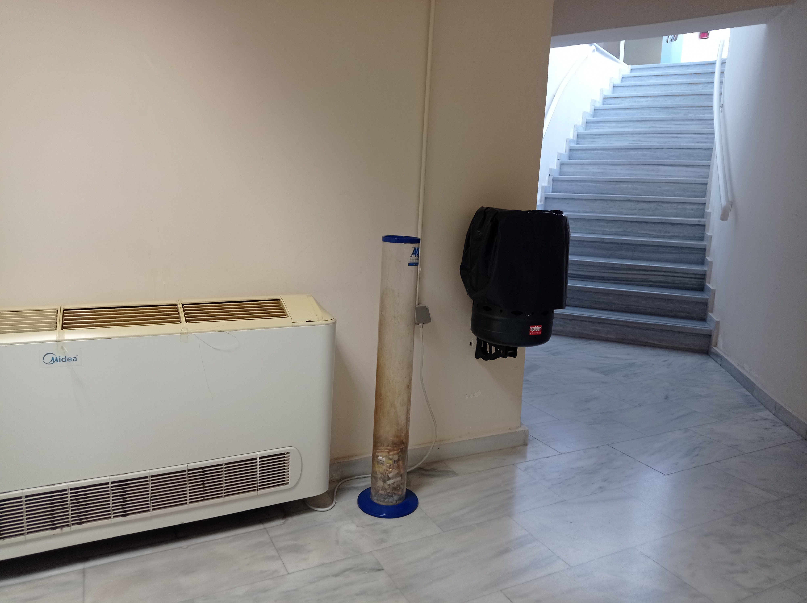
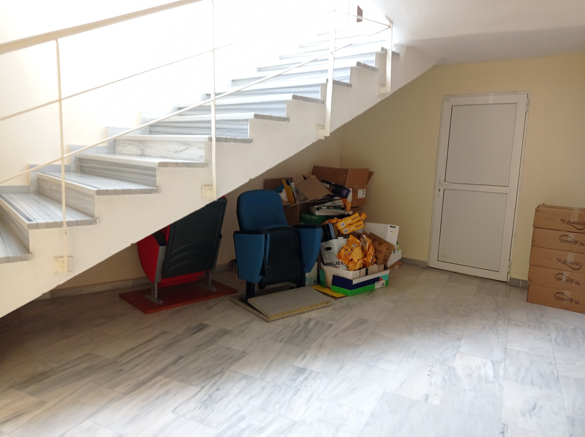
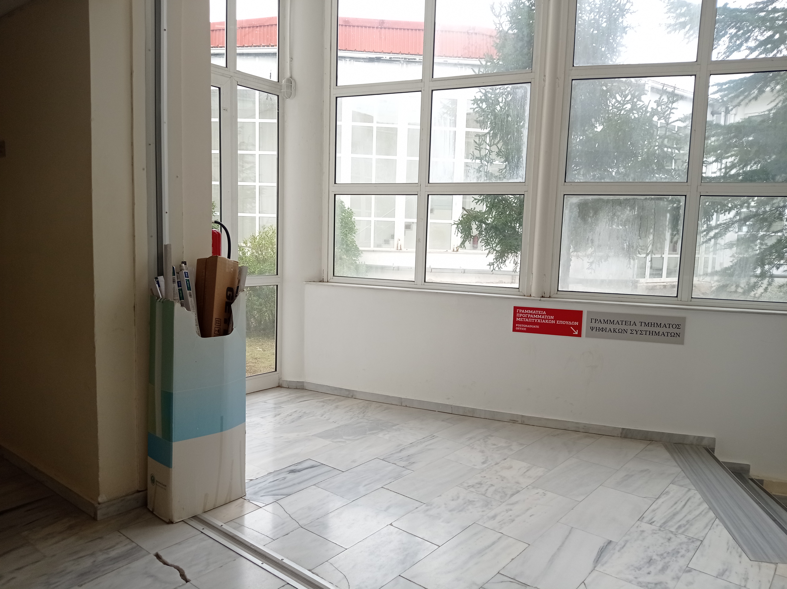

# Σημεία Συλλογής Ανακυκλώσιμων Υλικών στο Τμήμα Ψηφιακών Συστημάτων

| Υλικό | Τοποθεσία | Υπεύθυνος Συλλογής | Εικόνα |
| -------- | ------- | :-------: | ---- |
| Μπαταρίες       | Υπόγειο  | N/A | {width=180 height=y} |
| Μελάνι Εκτυπωτή | N/A      | N/A | N/A |
| Χαρτί           | Υπόγειο  | N/A | {width=180 height=y} |
| Λάμπες          | Ισόγειο | N/A | {width=180 height=y} |
| Ηλεκτρικές Συσκευές | Ισόγειο | N/A | N/A |
