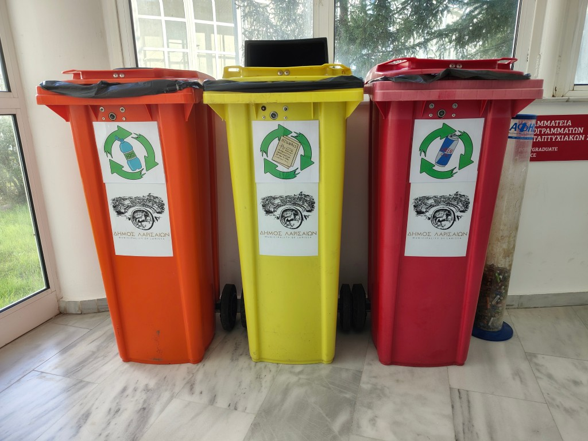

Ακολουθώντας τις βέλτιστες πρακτικές στη διαχείριση αποβλήτων, το Τμήμα Ψηφιακών Συστημάτων εφαρμόζει από τις αρχές του 2026 διαδικασίες διαλογής στην πηγή για τα απορρίμματά του. Στο πλαίσιο αυτό, το Τμήμα σε επαφή με αρμόδιους φορείς, δημιούργησε ένα κεντρικό σημείο συλλογής ανακυκλώσιμων υλικών.

Καθοριστική ήταν η συμβολή των φοιτητών, οι οποίοι σχεδίασαν και υλοποίησαν τον παρόντα δικτυακό τόπο. Μέσω της πλατφόρμας αυτής, κάθε ενδιαφερόμενος μπορεί να ενημερωθεί για τα είδη των υλικών και τις ακολουθούμενες διαδικασίες ανακύκλωσης εντός του Τμήματος.

| Απορρίμματα | Σημείο συλλογής | Φορέας συλλογής |
| ----------- | :-------: | :-------: |
| [Μπαταρίες](batteries.md)                 | Ισόγειο (A)    | <a href="https://afis.gr/" target="_blank">ΑΦΗΣ</a> |
| [Μελανοδοχεία/Toners](ink_containers.md)  | θα ανακοινωθεί | <a href="https://www.electrocycle.gr/" target="_blank">ανακύκλωση συσκευών α.ε.</a> |
| [Λάμπες](lightbulb.md)                    | Ισόγειο (A)    | <a href="https://www.electrocycle.gr/" target="_blank">ανακύκλωση συσκευών α.ε.</a> |
| [Ηλεκτρικές Συσκευές](devices.md)         | θα ανακοινωθεί | <a href="https://www.electrocycle.gr/" target="_blank">ανακύκλωση συσκευών α.ε.</a> |
| [Αλουμίνιο/Mέταλλα](aluminium.md)                 | Ισόγειο (A)    | <a href="https://www.larissa.gov.gr/el/e-upiresies/dnsi-kathariotitas-anakyklosis" target="_blank">Δήμος Λαρισαίων</a> |
| [Πλαστικό](plastic.md)                    | Ισόγειο (A)    | <a href="https://www.larissa.gov.gr/el/e-upiresies/dnsi-kathariotitas-anakyklosis" target="_blank">Δήμος Λαρισαίων</a> |
| [Χαρτί](paper.md)                         | Ισόγειο (A)    | <a href="https://www.larissa.gov.gr/el/e-upiresies/dnsi-kathariotitas-anakyklosis" target="_blank">Δήμος Λαρισαίων</a> |

Πατήστε στους συνδέσμους για περισσότερες πληροφορίες.

Εκφράζουμε τις θερμές μας ευχαριστίες στον Δήμο Λαρισαίων, την Ανακύκλωση ΑΕ και την ΑΦΗΣ για την άμεση ανταπόκριση και στήριξη της προσπάθειάς μας. Το Τμήμα Ψηφιακών Συστημάτων θα συνεχίσει τις δράσεις με γνώμονα την βιώσιμη ανάπτυξη και καλεί όλα τα μέλη της ακαδημαϊκής κοινότητάς του να συμμετέχουν ενεργά.
